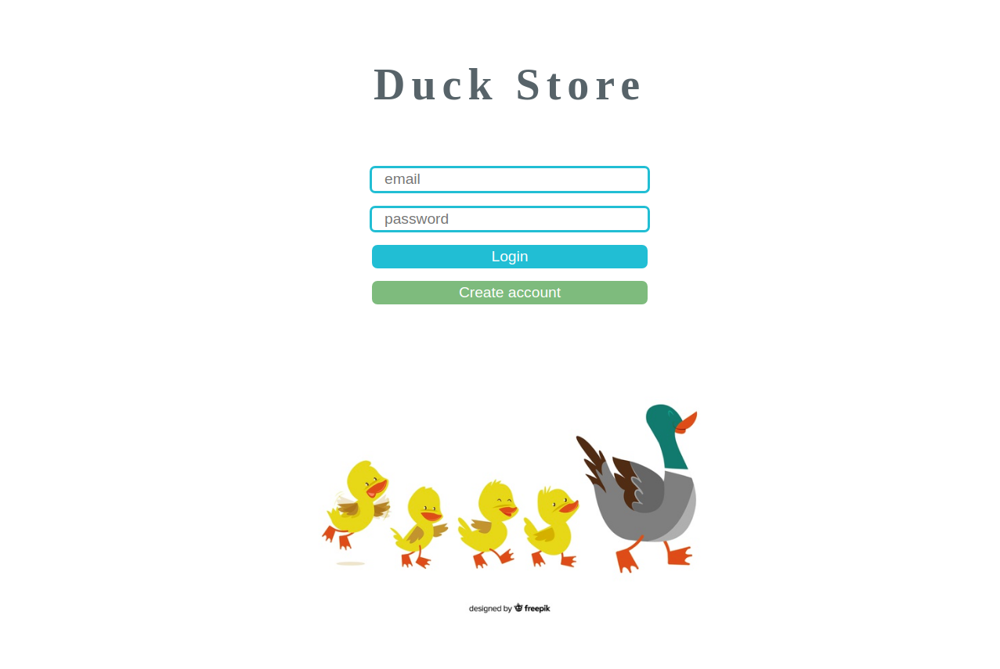
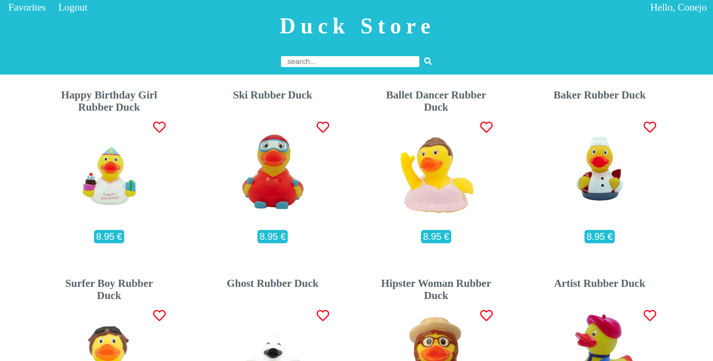

## Duck Store




## Introduction

This project was developed within the Skylab bootcamp.

Duck store is an ecommerce SPA that brings information about rubber ducks.
The user can also register, and login to acces to his account and select favourite restaurants that the app will save into 'Favourites' section.

## Features

- The user must have an account to enter to the App.
- Can create an account, loggin to enter to the store and logout to exit.
- Can make a search in the store to search rubber ducks.
- To see a detail about one product, can click in its picture.
- If the user likes a product, can mark it as favorite and consult all favorites in a Favorites section.

## What I learned

- How to create a login and register consuming an API used as data base.
- Make calls to an external API and show the results when a search is done.
- Create a Feedback component when an error is happened.
- Create a Favorites section.

## Technical Description

- This project has been developed in React with SASS and following BEM rules.
- For the API calls, AJAX has been utilized.
- Two APIs has been consumed, one for retrieve information about rubber Ducks, and the other, to create the users account and save his information safely.
- To keep the session active, I used the Session Storage.

## Usage

The project can be opened here https://diana-moreno.github.io/duck-app-react/.

Otherside, to run it in local, I have included Serve, a local server from an NPM library.

- Install Node.js at the terminal if you haven't yet (https://nodejs.org/es/). Commands for Ubuntu:

```bash
sudo apt-get update
sudo apt-get install nodejs
```
- You will need to install the package manager npm:

```bash
sudo apt-get install npm
```
- Clone or download the repository in your computer.

```bash
git clone https://github.com/diana-moreno/eat-the-world.git`
```
- Download the npm competitions in your own repository and start it.

```bash
npm install serve
npm start
```
- Open the project trought the links are provided by the server.

```
   │   Serving!                                        │
   │                                                   │
   │   - Local:            http://localhost:5000       │
   │   - On Your Network:  http://192.168.1.174:5000   │
   │                                                   │
   │   Copied local address to clipboard!              │
```
